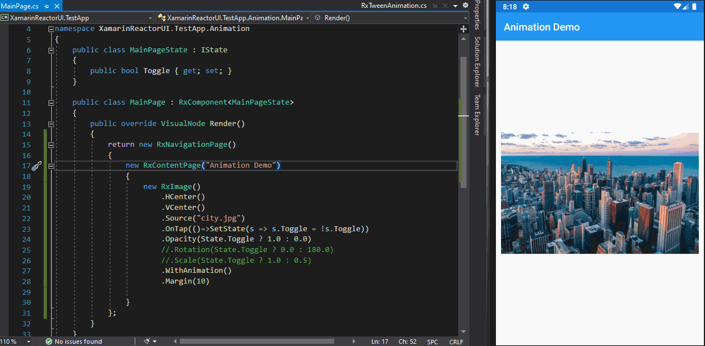

# Property-Base animation

This kind of animation is the first introduced in ReactorUI for Xamarin Forms library and essentially means _animating properties between component states_.&#x20;

.NET MAUI already contains a set of useful functions that let you move properties of controls over time according to a tween function. You can still use standard animation functions in MauiReactor, just get a reference to the control as explained [here](../accessing-native-controls.md).

In the most simple scenarios, enabling animations in MauiReactor is as simple as calling the function `WithAnimation()` over the component you want to animate.

Let's create an example to illustrate the overall process. Consider a page that contains a frame and an image inside it that is initially hidden. When the user taps the image we want to gradually show it and scale it to full screen.

This is the initial code of the sample:

```csharp
public class MainPageState
{
    public bool Toggle { get; set; }
}

public class MainPage : Component<MainPageState>
{
    public override VisualNode Render()
    {
        return new ContentPage()
        {
            new Frame()
            { 
                new Image()
                    .HCenter()
                    .VCenter()
                    .Source("city.jpg")
            }
            .OnTap(()=>SetState(s => s.Toggle = !s.Toggle))
            .HasShadow(true)
            .Scale(State.Toggle ? 1.0 : 0.5)
            .Opacity(State.Toggle ? 1.0 : 0.0)
            .Margin(10)
        };
    }
}
```

Running the application you should see something like this:

<figure><figcaption><p>Animating Scale and Opacity properties</p></figcaption></figure>

Now let's add `WithAnimation()` to image component:

```csharp
return new NavigationPage()
{
    new ContentPage("Animation Demo")
    {
        new Image()
            .HCenter()
            .VCenter()
            .Source("city.jpg")
            .OnTap(()=>SetState(s => s.Toggle = !s.Toggle))
            .Opacity(State.Toggle ? 1.0 : 0.0)
            .Scale(State.Toggle ? 1.0 : 0.5)
            .Margin(10)
            .WithAnimation()
    }
};
```

By default `WithAnimation()`enables any pending animation applied to the component before it: in the above sample `Opacity()`and `Scale()` by default add a tween animation each for the respective properties.

<figure><figcaption><p>Sample app with animation (video ported from ReactorUI for Xamarin Forms)</p></figcaption></figure>

Try experimenting with modifying the position of the call to WithAnimation() or passing a custom duration (600ms is the default value) or easing function (Linear is the default).&#x20;

\
Many other properties are _animatable_ by default but you can create custom animation with more complex algorithms for other properties or combinations of properties.\


This kind of animation in MauiReactor is inspired by the SwiftUI animation system, so you can even take a look at its documentation to discover other powerful ways of animating between states.\
