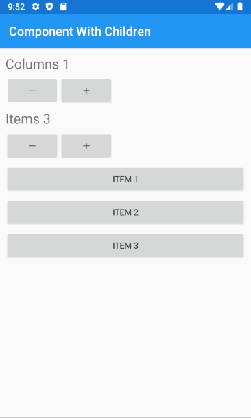

# Component with children

A component class derives from `Component` and must implement the `Render()` method. Inside it, local fields, properties, and of course State properties of stateful components are directly accessible and can be used to compose the resulting view.

Components can also render their children by calling the base method `Children()`. This opens up a powerful feature that can be useful if we want to build a component that arranges its children in some way.

Say we want, for example, to create a component that arranges its children within a customizable grid, like this:

<figure><figcaption></figcaption></figure>

As starting, let's create a component that builds our page:

```csharp
public class PageComponent : Component
{
    public override VisualNode Render()
    {
        return new NavigationPage()
        {
            new ContentPage()
            {

            }
            .Title("Component With Children")
        };
    }
}
```

This should show an empty page with just a title, then create a component for our grid (call it `WrapGrid`)

```csharp
public class WrapGrid : Component
{
    public override VisualNode Render()
    {
    }
}
```

Every `Component` class can access its children using the `Children()` method (it's similar to the `{this.props.children}` property in ReactJS)

```csharp
public class WrapGrid : Component
{
    public override VisualNode Render()
    {
        return new Grid()
        {
            Children().ToArray()
        };
    }
}

```

We can add a `ColumnCount` property and simple logic to arrange and wraps any children passed to the component like this:

```csharp
public class WrapGrid : Component
{
    private int _columnCount = 4;
    public WrapGrid ColumnCount(int columnCount)
    {
        _columnCount = columnCount;
        return this;
    }

    public override VisualNode Render()
    {
        int rowIndex = 0, colIndex = 0;

        int rowCount = Math.DivRem(Children().Count, _columnCount, out var divRes);
        if (divRes > 0)
            rowCount++;

        return new Grid(
            Enumerable.Range(1, rowCount).Select(_ => new RowDefinition() { Height = GridLength.Auto }),
            Enumerable.Range(1, _columnCount).Select(_ => new ColumnDefinition()))
        {
            Children().Select(child =>
            {
                child.GridRow(rowIndex);
                child.GridColumn(colIndex);
                
                colIndex++;
                if (colIndex == _columnCount)
                {
                    colIndex = 0;
                    rowIndex++;
                }

                return child;
            }).ToArray()
        };
    }
}
```

Finally, we just need to create the component from the main page and fill it with a list of child buttons:

```csharp
public class PageState
{
    public int ColumnCount { get; set; } = 1;

    public int ItemCount { get; set; } = 3;
}

public class PageComponent : Component<PageState>
{
    public override VisualNode Render()
    {
        return new NavigationPage()
        {
            new ContentPage()
            {
                new StackLayout()
                { 
                    new Label($"Columns {State.ColumnCount}")
                        .FontSize(Xamarin.Forms.NamedSize.Large),
                    new Stepper()
                        .Minimum(1)
                        .Maximum(10)
                        .Increment(1)
                        .Value(State.ColumnCount)
                        .OnValueChanged(_=> SetState(s => s.ColumnCount = (int)_.NewValue)),
                    new Label($"Items {State.ItemCount}")
                        .FontSize(Xamarin.Forms.NamedSize.Large),
                    new Stepper()
                        .Minimum(1)
                        .Maximum(20)
                        .Increment(1)
                        .Value(State.ItemCount)
                        .OnValueChanged(_=> SetState(s => s.ItemCount = (int)_.NewValue)),

                    new WrapGrid()
                    { 
                        Enumerable.Range(1, State.ItemCount)
                            .Select(_=> new Button($"Item {_}"))
                            .ToArray()
                    }
                    .ColumnCount(State.ColumnCount)                            
                }
                .Padding(10)
                .WithVerticalOrientation()
            }
            .Title("Component With Children")
        };
    }
}
```
