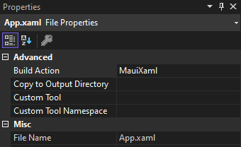

# Picker

> The .NET Multi-platform App UI (.NET MAUI) [Picker](https://learn.microsoft.com/en-us/dotnet/api/microsoft.maui.controls.picker) displays a short list of items, from which the user can select an item.

Official documentation:\
[https://learn.microsoft.com/en-us/dotnet/maui/user-interface/controls/picker](https://learn.microsoft.com/en-us/dotnet/maui/user-interface/controls/picker)\
\
MauiReactor sample app:\
[https://github.com/adospace/mauireactor-samples/tree/main/Controls/PickerTestApp](https://github.com/adospace/mauireactor-samples/tree/main/Controls/PickerTestApp)\
\
The sample code below shows how to implement the Picker control in MauiReactor:

```csharp

public record Person(string FirstName, string LastName, DateTime DateOfBirth)
{
    public override string ToString()
        => $"{FirstName} {LastName} ({(DateTime.Today.Year - DateOfBirth.Year)})";
};

class MainPageState
{
    public Person[] Persons { get; set; }

    public int SelectedPersonIndex { get; set; } = -1;

    public Person SelectedPerson 
        => SelectedPersonIndex == -1 ? null : Persons[SelectedPersonIndex];
}

class MainPage : Component<MainPageState>
{
    protected override void OnMounted()
    {
        var person1 = new Person("John", "Doe", new DateTime(1980, 5, 10));
        var person2 = new Person("Jane", "Smith", new DateTime(1990, 6, 20));
        var person3 = new Person("Alice", "Johnson", new DateTime(1985, 7, 30));
        var person4 = new Person("Bob", "Williams", new DateTime(2000, 8, 15));
        var person5 = new Person("Charlie", "Brown", new DateTime(1995, 9, 25));

        State.Persons = new[] { person1, person2, person3, person4, person5 };
        base.OnMounted();
    }

    public override VisualNode Render()
    {
        return new ContentPage
        {
            new VStack(spacing: 25)
            {
                new Picker()
                    .Title("Select a person")
                    .SelectedIndex(State.SelectedPersonIndex)
                    .ItemsSource(State.Persons.Select(_=> $"{_.FirstName} {_.LastName}").ToList())
                    .OnSelectedIndexChanged(index => SetState(s => s.SelectedPersonIndex = index)),

                new Label($"Selected: {State.SelectedPerson}"),

                new Button("Reset")
                    .OnClicked(()=> SetState(s => s.SelectedPersonIndex = -1))
            }
            .VCenter()
            .Padding(10,0)
        };
    }
}

```

<figure><figcaption><p>MauiReactor Picker in action</p></figcaption></figure>
