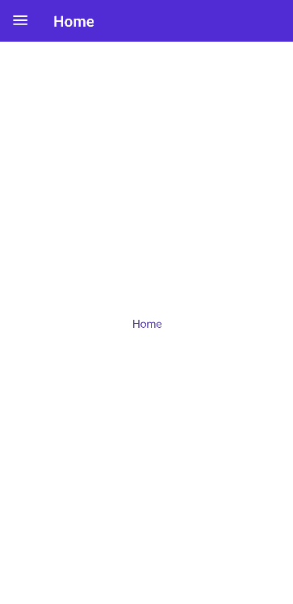
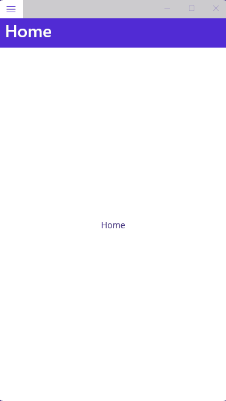
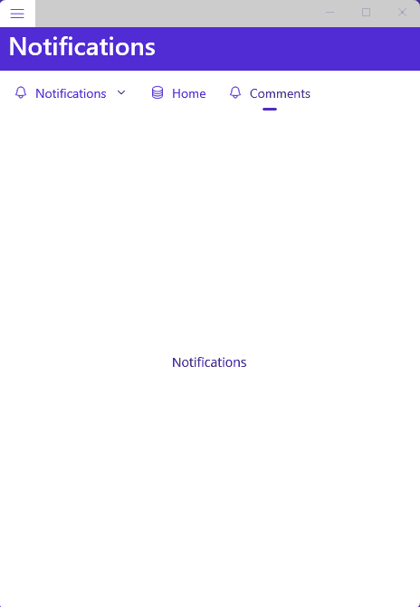

# Shell

> .NET Multi-platform App UI (.NET MAUI) Shell reduces the complexity of app development by providing the fundamental features that most apps require, including:
>
> * A single place to describe the visual hierarchy of an app.
> * A common navigation user experience.
> * A URI-based navigation scheme that permits navigation to any page in the app.
> * An integrated search handler.

Official documentation:\
[https://learn.microsoft.com/en-us/dotnet/maui/fundamentals/shell/](https://learn.microsoft.com/en-us/dotnet/maui/fundamentals/shell/)\
\
MauiReactor sample app:\
[https://github.com/adospace/mauireactor-samples/tree/main/Controls/ShellTestPage](https://github.com/adospace/mauireactor-samples/tree/main/Controls/ShellTestPage)

## Shell with ShellContents

The sample code below shows how to create a Shell with some pages using the ShellContent class:

```csharp
class MainPageState
{
    public int Counter { get; set; }
}

class MainPage : Component<MainPageState>
{
    public override VisualNode Render()
        => new Shell
        {
            new ShellContent("Home")
                .Icon("home.png")
                .RenderContent(()=> new HomePage()),

            new ShellContent("Comments")
                .Icon("comments.png")
                .RenderContent(()=> new CommentsPage()),
        };
}

class HomePage : Component
{
    public override VisualNode Render()
    {
        return new ContentPage("Home")
        {
            new Label("Home")
                .VCenter()
                .HCenter()
        };
    }
}

class CommentsPage : Component
{
    public override VisualNode Render()
    {
        return new ContentPage("Comments")
        {
            new Label("Comments")
                .VCenter()
                .HCenter()
        };
    }
}

```

<figure><figcaption><p>Shell in action in Android</p></figcaption></figure>

<figure><figcaption><p>Shell in action under Windows</p></figcaption></figure>


## Shell with Tab and FlyoutItem (AsMultipleItems)

Following it's another sample of Shell with more items arranged inside a FlyoutItem and Tab:

```csharp
    public override VisualNode Render()
        => new Shell
        {
            new FlyoutItem
            {
                new Tab
                {
                    new ShellContent("Home")
                        .Icon("home.png")
                        .RenderContent(()=> new HomePage()),

                    new ShellContent("Comments")
                        .Icon("comments.png")
                        .RenderContent(()=> new CommentsPage()),
                }
                .Title("Notifications")
                .Icon("bell.png"),


                new ShellContent("Home")
                    .Icon("database.png")
                    .RenderContent(()=> new DatabasePage()),

                new ShellContent("Comments")
                    .Icon("bell.png")
                    .RenderContent(()=> new NotificationsPage()),
            }
            .FlyoutDisplayOptions(MauiControls.FlyoutDisplayOptions.AsMultipleItems)
        };

```

<figure><figcaption><p>Shell under Windows</p></figcaption></figure>

<figure><figcaption><p>Shell under Android</p></figcaption></figure>

## Custom FlyoutItem appearance

In the following code, FlyoutItems appearance is customized:


```csharp
public override VisualNode Render()
    => new Shell
    {
        new ShellContent("Home")
            .Icon("home.png")
            .RenderContent(()=> new HomePage()),

        new ShellContent("Comments")
            .Icon("comments.png")
            .RenderContent(()=> new CommentsPage()),
    }
    .ItemTemplate(RenderItemTemplate);

static VisualNode RenderItemTemplate(MauiControls.BaseShellItem item)
     => new Grid("68", "Auto, *")
     {
         new Image()
            .Source(item.FlyoutIcon)
            .Margin(4),

         new Label(item.Title)
            .GridColumn(1)
            .VCenter()
            .TextDecorations(TextDecorations.Underline)
            .FontAttributes(MauiControls.FontAttributes.Bold)
            .Margin(10,0)
     };
```

<figure><figcaption><p>Customized FlyoutItems</p></figcaption></figure>

## Custom FlyoutContent

You can also provide custom content for the Flyout as shown below:

```csharp
public override VisualNode Render()
    => new Shell
    {
        new ShellContent("Home")
            .Route(nameof(HomePage))
            .Icon("home.png")
            .RenderContent(()=> new HomePage()),

        new ShellContent("Comments")
            .Route(nameof(CommentsPage))
            .Icon("comments.png")
            .RenderContent(()=> new CommentsPage()),
    }
    .FlyoutContent(RenderFlyoutContent());


VisualNode RenderFlyoutContent()
{
    return new ScrollView
    {
        new VStack(spacing: 5)
        {
            new Button("Home")
                .OnClicked(async ()=> await MauiControls.Shell.Current.GoToAsync($"//{nameof(HomePage)}")),

            new Button("Comments")
                .OnClicked(async ()=> await MauiControls.Shell.Current.GoToAsync($"//{nameof(CommentsPage)}")),
        }
    };
}

```

<figure><figcaption><p>Custom Shell FlyoutContent</p></figcaption></figure>

## Shell menu items

You can also create simple menu item inside the shell with custom command:

```csharp
public override VisualNode Render()
    => new Shell
    {
        new ShellContent("Home")
            .Route(nameof(HomePage))
            .Icon("home.png")
            .RenderContent(()=> new HomePage()),

        new ShellContent("Comments")
            .Route(nameof(CommentsPage))
            .Icon("comments.png")
            .RenderContent(()=> new CommentsPage()),

        new MenuItem("Click me!")
            .OnClicked(async ()=> await ContainerPage.DisplayAlert("MauiReactor", "Clicked!", "OK"))
    };
```

<figure><figcaption></figcaption></figure>

In the following sample code, we're going to customize the MenuItems:

```csharp
public override VisualNode Render()
    => new Shell
    {
        new MenuItem("Click me!")
            .IconImageSource("gear.png")
            .OnClicked(async ()=> await ContainerPage.DisplayAlert("MauiReactor", "Clicked!", "OK"))
    }
    .MenuItemTemplate(menuItem =>
        new Grid("65", "Auto, *")
        {
            new Image()
                .Source(menuItem.IconImageSource)
                .VCenter(),

            new Label(menuItem.Text)
                .TextColor(Colors.Red)
                .VCenter()
                .Margin(10,0)
                .FontAttributes(MauiControls.FontAttributes.Bold)
                .GridColumn(1)
        }
        .Padding(10,0)
        );
```

<figure><figcaption><p>Custom MenuItem</p></figcaption></figure>
