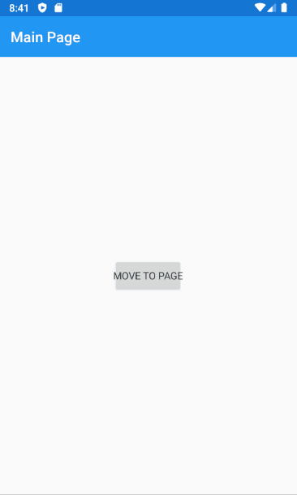
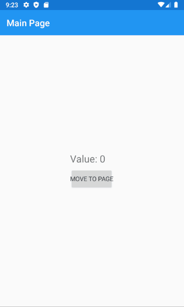

# NavigationPage

You can navigate between pages (i.e. between root components) using the following extensions API:

```
INavigation.PushAsync<T>()
```

where T is the type of component to create as the root of the new page.

For example, this is a component that moves to a second page hosting the ChildPageComponent when the user click a button:

```csharp
public class MainPageComponent : Component
{
    public override VisualNode Render()
    {
        return new NavigationPage()
        {
            new ContentPage()
            {
                new Button("Move To Page")
                    .VCenter()
                    .HCenter()
                    .OnClicked(OpenChildPage)
            }
            .Title("Main Page")
        };
    }

    private async void OpenChildPage()
    {
        await Navigation.PushAsync<ChildPageComponent>();
    }
}
```

and, this is the code implementing the child page component with a button to go back

```csharp
public class ChildPageComponent : Component
{
    public override VisualNode Render()
    {
        return new ContentPage()
        {
            new Button("Back")
                .VCenter()
                .HCenter()
                .OnClicked(GoBack)
        }
        .Title("Child Page");
    }

    private async void GoBack()
    {
        await Navigation.PopAsync();
    }
}
```

<figure><figcaption></figcaption></figure>

## Passing data between pages

We can pass parameters to other pages through component _Props_. Modify the main page component from the above sample to hold a state:

```csharp
public class MainPageComponentState
{
    public int Value { get; set; }
}

public class MainPageComponent : Component<MainPageComponentState>
{
    public override VisualNode Render()
    {
        return new NavigationPage()
        {
            new ContentPage()
            {
                new StackLayout()
                {
                    new Label($"Value: {State.Value}")
                        .FontSize(NamedSize.Large),
                    new Button("Move To Page")
                        .OnClicked(OpenChildPage)
                }
                .VCenter()
                .HCenter()
            }
            .Title("Main Page")
        };
    }

    private async void OpenChildPage()
    {

    }
}
```

In the `OpenChildPage` callback we need to open the child page passing the current value: we want to edit the value in entry control.\
Let's change the child page by adding a state and a props class as shown in the following code:

```csharp
public class ChildPageComponentState
{
    public int Value { get; set; }
}

public class ChildPageComponentProps
{
    public int InitialValue { get; set; }

    public Action<int> OnValueSet { get; set; }
}

public class ChildPageComponent : Component<ChildPageComponentState, ChildPageComponentProps>
{
    protected override void OnMounted()
    {
        State.Value = Props.InitialValue;

        base.OnMounted();
    }

    public override VisualNode Render()
    {
        return new ContentPage()
        {
            new StackLayout()
            {
                new Entry(State.Value.ToString())
                    .OnAfterTextChanged(_=>SetState(s => s.Value = int.Parse(_)))
                    .Keyboard(Keyboard.Numeric),
                new Button("Back")
                    .OnClicked(GoBack)
            }
            .VCenter()
            .HCenter()
        }
        .Title("Child Page");
    }

    private async void GoBack()
    {
        Props.OnValueSet(State.Value);

        await Navigation.PopAsync();
    }
}

```

Now the ChildPageComponent has a _state_ and a _props_: the latter will hold the initial value and a callback action to call when the user click the back button.

Finally, call the child page setting its _props_ properties:

```csharp
private async void OpenChildPage()
{
    await Navigation.PushAsync<ChildPageComponent, ChildPageComponentProps>(_=>
    {
        _.InitialValue = State.Value;
        _.OnValueSet = this.OnValueSetFromChilPage;
    });
}

private void OnValueSetFromChilPage(int newValue)
{
    SetState(s => s.Value = newValue);
}
```

<figure><figcaption><p>Resulting app behavior </p></figcaption></figure>

## Handle notifications from pages when appearing or disappearing

In MauiReactor components are deactivated when are no more referenced by any other parent components: when this happens MauiReactor calls the `OnWillUnmount` method to let the developer do extra finalization stuff.\
Makes exceptions the case when the component is the root of the page. For performance reasons when the page disappears, MauiReactor doesn't traverse for the last time the visual tree so it doesn't call the `OnWillUnmount` on the root component.

Maybe you need to do some work when the page is disappearing; the following code shows how you handle the disappearing event from both the calling and the called page.

```csharp
public class FirstPage : Component
{
    protected override void OnWillUnmount()
    {
        //this won't be called because is the root component of the page
        Debug.WriteLine("OnWillUnmount FirstPage");
    }

    protected override void OnMounted()
    {
        Debug.WriteLine("OnMounted FirstPage");
    }

    public override VisualNode Render()
    {
        return new ContentPage()
        {
            new VStack()
            {
                new Label("First!"),
                new Button("Next")
                    .OnClicked(async () => 
                    { 
                        var secondPage = await Navigation?.PushAsync<SecondPage>();
                        secondPage.Disappearing+=(s,e)=> Debug.WriteLine("Disappearing SecondPage");
                    })
            }
            .Spacing(20)
            .HCenter()
            .VCenter()
        }.Title("First");
    }
}

public class SecondPage : Component
{
    protected override void OnWillUnmount()
    {
        //this won't be called because is the root component of the page
        Debug.WriteLine("OnWillUnmount SecondPage");
    }

    protected override void OnMounted()
    {
        Debug.WriteLine("OnMounted SecondPage");
    }

    public override VisualNode Render()
    {
        return new ContentPage()
        {
            new VStack()
            {
                new Label("Second!"),
                new Button("Back")
                    .OnClicked(() => Navigation?.PopAsync())
            }
            .Spacing(20)
            .HCenter()
            .VCenter()
        }
        .Title("Second")
        .OnDisappearing(()=> Debug.WriteLine("Disappearing SecondPage from SecondPage"));
    }
}

public class App : Component
{
    public override VisualNode Render()
    {
        return new NavigationPage()
        {
            new FirstPage()
        }.Set(MauiControls.NavigationPage.BarTextColorProperty, Colors.White);
    }
}c
```
