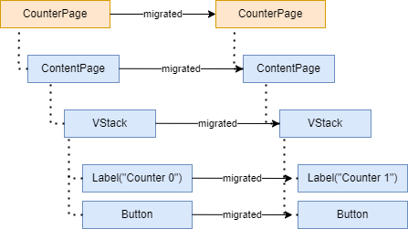

# Stateful Components

A stateful component is a component tied to a state class that is used to keep its "state" during its lifetime.

A state is just a C# class with an empty constructor.

When a Component is first displayed on the page, i.e. the MAUI widget is added to the page visual tree, MauiReactor calls the method `OnMounted()`.&#x20;

Before the component is removed from the page visual tree MauiReactor calls the `OnWillUnmount()` method.

Every time a Component is "migrated" (i.e. it is preserved between a state change) the `OnPropsChanged()` overload is called.

`OnMounted()` is the ideal point to initialize the component, for example calling web services or querying the local database to get the required information to render it in the `Render()` method.

For example, in this code we'll show an activity indicator while the Component is loading:

```csharp
public class BusyPageState
{
    public bool IsBusy { get; set; }
}

public class BusyPageComponent : Component<BusyPageState>
{
    protected override void OnMounted()
    {
        //Here is not advisable to call SetState() as the component is still not rendered yet
        State.IsBusy = true;

        //just for a test run a background task
        Task.Run(async () =>
        {
            //Simulate lengthy work
            await Task.Delay(3000);

            //finally reset state IsBusy property
            SetState(_ => _.IsBusy = false);
        });

        base.OnMounted();
    }

    public override VisualNode Render()
    {
        return new ContentPage()
        {
            new ActivityIndicator()
                .VCenter()
                .HCenter()
                .IsRunning(State.IsBusy)
        };
    }
}

```

and this is the resulting app:

<figure><figcaption></figcaption></figure>

NOTE: Do not use constructors to pass parameters to the component, but public properties instead (take a look at the Custom Components documentation page).&#x20;

## Updating the component State

When you need to update the state of your component you have to call the `SetState` method as shown above.&#x20;

When you call `SetState` the component is marked as _Invalid_ and MauiReactor triggers a refresh of the component. This happens following a series of steps in a fixed order

1. The component is marked as _Invalid_
2. The parent and ancestors up to the root component of the page are all marked as _Invalid_
3. MauiReactor triggers a refresh under the UI thread that creates a new Visual tree traversing the component tree
4. All the components that are _Valid_ are re-used (maintained in the VisualTree) while the components marked as _Invalid_ are discarded and a new version is created and its Render method called
5. The new component version creates a new tree of child nodes/components that are compared with the tree linked to the old version of the component
6. The old visual tree is compared to the new one: new nodes are created along with the native control (i.e. are mounted), removed nodes are eliminated along with the native control (i.e. are unmounted), and finally, nodes that are only changed (i.e. old and new nodes are of the same type) are migrated (i.e. native control is reused and its properties are updated according to properties of the new visual node)
7. In the end, the native controls are added, removed, or updated

For example, let's consider what happens when we tap the Increment button in the sample component below:

```csharp
class CounterPageState
{
    public int Counter { get; set; }
}

class CounterPage : Component<CounterPageState>
{
    public override VisualNode Render()
    {
        return new ContentPage("Counter Sample")
        {
            new VStack(spacing: 10)
            {
                new Label($"Counter: {State.Counter}")
                    .VCenter()
                    .HCenter(),

                new Button("Click To Increment", () =>
                    SetState(s => s.Counter++))
            }
            .VCenter()
            .HCenter()
        };
    }
}
```

<figure><figcaption><p>All components are migrated/updated</p></figcaption></figure>

Let's consider now this revisited code:

```csharp
class CounterPageState
{
    public int Counter { get; set; }
}

class CounterPage : Component<CounterPageState>
{
    public override VisualNode Render()
    {
        return new ContentPage("Counter Sample")
        {
            new VStack(spacing: 10)
            {
                State.Counter == 0 ? new Label($"Counter: {State.Counter}")
                    .VCenter()
                    .HCenter() : null,

                new Button("Click To Increment", () =>
                    SetState(s => s.Counter++))
            }
            .VCenter()
            .HCenter()
        };
    }
}
```

When the button is clicked the variable State.Counter is updated to 1 so the component is re-rendered and the Label is umounted (i.e. removed from the visual tree) and native control is removed from the parent VStack Control list (i.e. de-allocated):

<figure><figcaption><p>Label is unmounted (i.e. removed from visual tree) </p></figcaption></figure>

If we click again the button, the Label component is found again in the new version of the Tree so it's mounted and a new instance of the Label component is created (along with the Native control that is created and added to the parent VStack control list).&#x20;

<figure><figcaption><p>Label is mounted</p></figcaption></figure>

## Updating the state "without" trigger a refresh

Re-creating the visual tree can be expensive, especially if the component tree is deep or the components contain many nodes; but sometimes you can update the state "without" triggering a refresh of the tree resulting in a pretty good performance improvement.

For example, consider again the counter sample but adds a debug message that helps trace when the component is rendered/created (line 10):


```csharp
class CounterPageState
{
    public int Counter { get; set; }
}

class CounterPage : Component<CounterPageState>
{
    public override VisualNode Render()
    {
        Debug.WriteLine("Render");
        return new ContentPage("Counter Sample")
        {
            new VStack(spacing: 10)
            {
                new Label($"Counter: {State.Counter}")
                    .VCenter()
                    .HCenter(),

                new Button("Click To Increment", () =>
                    SetState(s => s.Counter++))
            }
            .VCenter()
            .HCenter()
        };
    }
}
```


Each time you click the button you should see the "Render" string output on the console of your IDE: this means, as explained, that a new Visual Tree has been created.

Now, take for example that we want just to update the label text and nothing else. In this case, we can take full advantage of a MauiReactor feature that let us just update the native control _without_ requiring a complete refresh.

Let's change the sample code to this:

<pre class="language-csharp" data-line-numbers><code class="lang-csharp">class CounterPageState
{
    public int Counter { get; set; }
}

class CounterPage : Component&#x3C;CounterPageState>
{
    public override VisualNode Render()
    {
        Debug.WriteLine("Render");
        return new ContentPage("Counter Sample")
        {
            new VStack(spacing: 10)
            {
<strong>                new Label(()=> $"Counter: {State.Counter}")
</strong>                    .VCenter()
                    .HCenter(),

                new Button("Click To Increment", () =>
<strong>                    SetState(s => s.Counter++, invalidateComponent: false))
</strong>            }
            .VCenter()
            .HCenter()
        };
    }
}
</code></pre>

Notice the changes to lines 15 and 20:

15: we use an overload of the `Label()` class that accepts a `Func<string>`\
20: secondly we call `SetState(..., invalidateComponent: false)`&#x20;

Now if you click the button, no Render message should be written to the console output: this proves that we're updating the native Label `without` recreating the component.&#x20;

Of course, this is not possible every time (for example when a change in the state should result in a change of the component tree) but when it is, should be considered to improve the responsiveness of the app.
