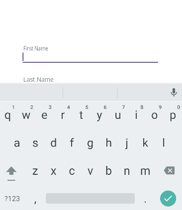

# Inline Components

MauiReactor also features a nice ability to wrap a stateful component within a function.


Inline components are somewhat inspired by React hooks so you may notice some similarities if you already have experience with them.


For example, consider that we want to create a custom Entry control that works like the Material entry widget:

<figure><figcaption></figcaption></figure>

This is the usual way we would create it in MauiReactor:

```csharp
class MudEntryState
{
    public bool Focused { get; set; }

    public bool IsFilled { get; set; }
}

partial class MudEntry : Component<MudEntryState>
{
    MauiControls.Entry _entryRef;
    
    [Prop]
    Action<string>? _textChanged;
    [Prop]
    string _label;

    public override VisualNode Render()
     => Grid("Auto", "*",
            Entry(entryRef => _entryRef = entryRef)
                .OnAfterTextChanged(OnTextChanged)
                .VCenter()
                .OnFocused(()=>SetState(s => s.Focused = true))
                .OnUnfocused(()=>SetState(s => s.Focused = false)),

            Label(_label)                
                .OnTapped(()=>_entryRef?.Focus())
                .Margin(5,0)
                .HStart()
                .VCenter()
                .TranslationY(State.Focused || State.IsFilled ? -20 : 0)
                .ScaleX(State.Focused || State.IsFilled ? 0.8 : 1.0)
                .AnchorX(0)
                .TextColor(!State.Focused || !State.IsFilled ? Colors.Gray : Colors.Red)
                .WithAnimation(duration: 200),
        )
        .VCenter();    

    private void OnTextChanged(string text)
    {
        SetState(s => s.IsFilled = !string.IsNullOrWhiteSpace(text));
        _textChanged?.Invoke(text);
    }
}
```

MauiReactor allows you to collapse the component + state in the single declaration that you can return from a function:

<pre class="language-csharp" data-line-numbers><code class="lang-csharp">static VisualNode RenderMudEntry(string label, Action&#x3C;string> textChangedAction)
<strong>    => Render&#x3C;(bool IsFocused, bool IsFilled)>(state =>
</strong>    {
        MauiControls.Entry _entryRef = null;

        return new Grid("Auto", "*")
        {
            new Entry(entryRef => _entryRef = entryRef)
                .OnAfterTextChanged(text =>
                {
                    state.Set(s => (s.IsFocused, IsFilled: !string.IsNullOrWhiteSpace(text)));
                    textChangedAction?.Invoke(text);
                })
                .VCenter()
                .OnFocused(()=>state.Set(s => (IsFocused: true, s.IsFilled)))
                .OnUnfocused(()=>state.Set(s => (IsFocused: false, s.IsFilled))),

            new Label(label)
                .OnTapped(() =>_entryRef?.Focus())
                .Margin(5,0)
                .HStart()
                .VCenter()
                .TranslationY(state.Value.IsFocused || state.Value.IsFilled ? -20 : 0)
                .ScaleX(state.Value.IsFocused || state.Value.IsFilled ? 0.8 : 1.0)
                .AnchorX(0)
                .TextColor(!state.Value.IsFocused || !state.Value.IsFilled ? Colors.Gray : Colors.Red)
                .WithAnimation(duration: 200),
        }
        .VCenter();
    });

</code></pre>

In Line 2 we use the static method Component.Render() which takes a Func\<VisualNode>. It creates a hidden stateful component on the fly and uses the passed function to render its content.

In Line 5 we declare our state using the method UseState\<S>() where S is the type of state we need to render the component.\
You can pass any type to it but, of course, the beauty of the solution is to take everything contained in the function without external references. In the above sample, we use a c# Tuple that has 2 properties IsFocused and IsFilled.

The rest of the function is more or less the same as the content of the Render method.

Inline Components are a perfect choice to render small components that have simple states, you can for example put it in a generic static class that provides general theming functions to the app.
