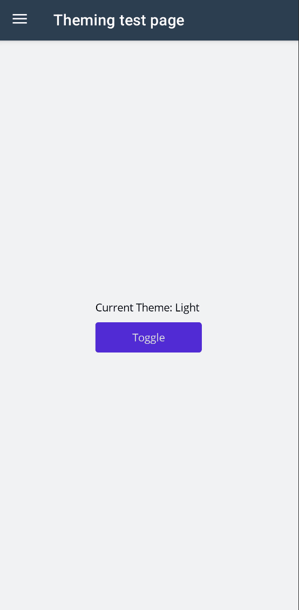

# Theming

In .NET MAUI application, one, usually, creates control styles in a bunch of XAML files in the Resources folder.

For example, the following XAML styles the Label with a custom text color and font family.

```xml
<Style TargetType="Label">
    <Setter Property="TextColor" Value="{DynamicResource Primary}" />
    <Setter Property="FontFamily" Value="OpenSansRegular" />
</Style>
```

MauiReactor supports XAML styling as well, you just need to reference your XAML files when setting up the MauiReactor application as shown below:


Since version 3, MauiReactor has had a different way of handling XAML resources, which can be seen [here](../whats-new-in-version-3.md).


```csharp
builder
    .UseMauiReactorApp<HomePage>(app =>
    {
        app.AddResource("Resources/Styles/DefaultTheme.xaml");
    })
```

Starting from version 2.0.34, MauiReactor also allows control styling using C#.

To create your theme, you have to define a class deriving from the MauiReactor Theme class and override the OnApply method.&#x20;

```csharp
class AppTheme : Theme
{
   protected override void OnApply()
   {
   ...
   }
}
```

You have to register the theme in the app definition in your program.cs file as shown below:

```csharp
var builder = MauiApp.CreateBuilder();
builder
    .UseMauiReactorApp<MainPage>(app =>
    {
        app.UseTheme<AppTheme>();
    })
```

For example, the following theme class defines a few default styles for the Label and Button controls.&#x20;

```csharp
class AppTheme : Theme
{
    public static Color Primary = Color.FromArgb("#512BD4");
    public static Color PrimaryDark = Color.FromArgb("#ac99ea");
    public static Color PrimaryDarkText = Color.FromArgb("#242424");
    public static Color Secondary = Color.FromArgb("#DFD8F7");
    public static Color SecondaryDarkText = Color.FromArgb("#9880e5");
    public static Color Tertiary = Color.FromArgb("#2B0B98");
    public static Color White = Color.FromArgb("White");
    public static Color Black = Color.FromArgb("Black");
    public static Color Magenta = Color.FromArgb("#D600AA");
    public static Color MidnightBlue = Color.FromArgb("#190649");
    public static Color OffBlack = Color.FromArgb("#1f1f1f");
    public static Color Gray100 = Color.FromArgb("#E1E1E1");
    public static Color Gray200 = Color.FromArgb("#C8C8C8");
    public static Color Gray300 = Color.FromArgb("#ACACAC");
    public static Color Gray400 = Color.FromArgb("#919191");
    public static Color Gray500 = Color.FromArgb("#6E6E6E");
    public static Color Gray600 = Color.FromArgb("#404040");
    public static Color Gray900 = Color.FromArgb("#212121");
    public static Color Gray950 = Color.FromArgb("#141414");

    public static SolidColorBrush PrimaryBrush = new(Primary);
    public static SolidColorBrush SecondaryBrush = new(Secondary);
    public static SolidColorBrush TertiaryBrush = new(Tertiary);
    public static SolidColorBrush WhiteBrush = new(White);
    public static SolidColorBrush BlackBrush = new(Black);
    public static SolidColorBrush Gray100Brush = new(Gray100);
    public static SolidColorBrush Gray200Brush = new(Gray200);
    public static SolidColorBrush Gray300Brush = new(Gray300);
    public static SolidColorBrush Gray400Brush = new(Gray400);
    public static SolidColorBrush Gray500Brush = new(Gray500);
    public static SolidColorBrush Gray600Brush = new(Gray600);
    public static SolidColorBrush Gray900Brush = new(Gray900);
    public static SolidColorBrush Gray950Brush = new(Gray950);

    private static bool LightTheme => Application.Current?.UserAppTheme == Microsoft.Maui.ApplicationModel.AppTheme.Light;

    protected override void OnApply()
    {
        ButtonStyles.Default = _ => _
            .TextColor(LightTheme ? White : PrimaryDarkText)
            .FontFamily("OpenSansRegular")
            .BackgroundColor(LightTheme ? Primary : PrimaryDark)
            .FontSize(14)
            .BorderWidth(0)
            .CornerRadius(8)
            .Padding(14,10)
            .MinimumHeightRequest(44)
            .MinimumWidthRequest(44)
            .VisualState("CommonStates", "Disabled", MauiControls.Button.TextColorProperty, LightTheme ? Gray950 : Gray200)
            .VisualState("CommonStates", "Disabled", MauiControls.Button.BackgroundColorProperty, LightTheme ? Gray200 : Gray600)
            ;

        LabelStyles.Default = _ => _
            .TextColor(LightTheme ? Black : White)
            .FontFamily("OpenSansRegular")
            .FontSize(14)
            .VisualState("CommonStates", "Disabled", MauiControls.Label.TextColorProperty, LightTheme ? Gray300 : Gray600)
            ;

    }
}
```

All the MauiReactor controls can be styled using the class named after the control name (i.e. LabelStyles, ButtonStyles, ViewStyles, etc).


Theming fully supports hot reload: style changes are reflected in the running application.


You can also use "selectors" (like in CSS) to define additional styles for each control. A selector is a unique string attached to the style.&#x20;

For example, I can define a different style for the label as shown below:

```csharp
LabelStyles.Themes["Title"] = _ => _
    .FontSize(20);
```

You can select the style using the `ThemeKey` property:

```csharp
Label()
   .ThemeKey("Title");
```

Given that selectors should be unique, a common approach is to create a const string property to use in the style definition and with the ThemeKey property.

For example:

```csharp
public const string Title = nameof(Title);

LabelStyles.Themes[Title] = _ => _
        .FontSize(20);
        
Label()
   .ThemeKey(AppTheme.Title);


```


Theming also works with custom third-party controls that are scaffolded as described [here](wrap-3rd-party-controls/).


## Dark theme support

The theming feature allows you to define different styles for the Dark and Light theme.

For example, consider the following app theme definition:

```csharp
class AppTheme : Theme
{
    public static void ToggleCurrentAppTheme()
    {
        if (MauiControls.Application.Current != null)
        {
            MauiControls.Application.Current.UserAppTheme = IsDarkTheme ? Microsoft.Maui.ApplicationModel.AppTheme.Light : Microsoft.Maui.ApplicationModel.AppTheme.Dark;
        }
    }

    public static Color DarkBackground { get; } = Color.FromArgb("#FF17171C");
    public static Color DarkText { get; } = Color.FromArgb("#FFFFFFFF");
    public static Color LightBackground { get; } = Color.FromArgb("#FFF1F2F3");
    public static Color LightText { get; } = Color.FromArgb("#FF000000");

    protected override void OnApply()
    {
        ContentPageStyles.Default = _ => _
            .BackgroundColor(IsDarkTheme ? DarkBackground : LightBackground);

        LabelStyles.Default = _ => _
            .TextColor(IsDarkTheme ? DarkText : LightText);
    }
}
```

MauiReactor automatically responds to user or system theme change requests and accordingly calls the OnApply overload to allow you to change styles for the Dark and Light theme.

For example:

```csharp
public override VisualNode Render()
 => ContentPage(
        VStack(
            Label($"Current Theme: {Theme.CurrentAppTheme} "),

            Button("Toggle", ()=>AppTheme.ToggleCurrentAppTheme())
            )
        .Spacing(10)
        .Center()
    );
```

The above code builds this app page:

<figure><figcaption><p>Dark theme sample app</p></figcaption></figure>
