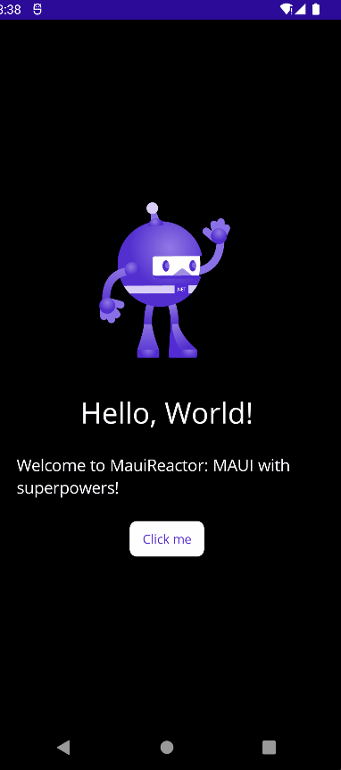

# Lottie animations


This article is based on the package [SkiaSharp.Extended.UI.Maui](https://mono.github.io/SkiaSharp.Extended/api/ui-maui/index.html) which it's currently in preview.&#x20;


Since Xamarin Forms, developers can integrate powerful animations inside their applications thanks to [Lottie](https://lottiefiles.com/) animation system implementation.

In .NET MAUI, you have the ability to play Lottie files using a relatively recent Skia-based implementation available inside [https://github.com/mono/SkiaSharp.Extended/](https://github.com/mono/SkiaSharp.Extended/) package.

Using Lottie controls in MauiReactor is straightforward, it just requires you to add a package reference in csproj and to create a few scaffold classes inside your project.

First of all, add the reference to [SkiaSharp.Extended.UI.Maui](https://mono.github.io/SkiaSharp.Extended/api/ui-maui/index.html) and MauiReactor Scaffold Generator packages:

```
<PackageReference Include="Reactor.Maui.ScaffoldGenerator" Version="1.0.74-beta" OutputItemType="Analyzer" ReferenceOutputAssembly="false" />
<PackageReference Include="SkiaSharp.Extended.UI.Maui" Version="2.0.0-preview.61" />
```

The next step is to call the method `UseSkiaSharp()` inside the MainProgram.cs file to enable SkiaSharp handlers.

<pre class="language-csharp" data-line-numbers><code class="lang-csharp">var builder = MauiApp.CreateBuilder();
builder
    .UseMauiReactorApp&#x3C;MainPage>()
<strong>    .UseSkiaSharp()
</strong></code></pre>

After that, you have to create a few MauiReactor wrappers for the control SKLottieView which can load and play the animation:

```csharp
[Scaffold(typeof(SkiaSharp.Extended.UI.Controls.SKSurfaceView))]
partial class SKSurfaceView { }

[Scaffold(typeof(SkiaSharp.Extended.UI.Controls.SKAnimatedSurfaceView))]
partial class SKAnimatedSurfaceView { }

[Scaffold(typeof(SkiaSharp.Extended.UI.Controls.SKLottieView))]
partial class SKLottieView { }

```

Note that you can't just wrap the `SKLottieView` but you have to generate wrappers also for the ancestors `SKAnimatedSurfaceView` and `SKSurfaceView` up to the `TemplateView` class which is already wrapped by MauiReactor itself.

Finally, you can use the control inside your component:

```csharp
new SKLottieView()
    .Source(new SkiaSharp.Extended.UI.Controls.SKFileLottieImageSource()
    {
        File = "dotnetbot.json"
    })
    .IsAnimationEnabled(true)
    .RepeatCount(-1)
    .HeightRequest(200)
    .WidthRequest(200)
    .HCenter()

```


The animation file (dotnetbot.json in the above example) must be placed inside the Resources\Raw folder.


This should be the final page with the animation running:

<figure><figcaption><p>Lottie animation in MauiReactor</p></figcaption></figure>
