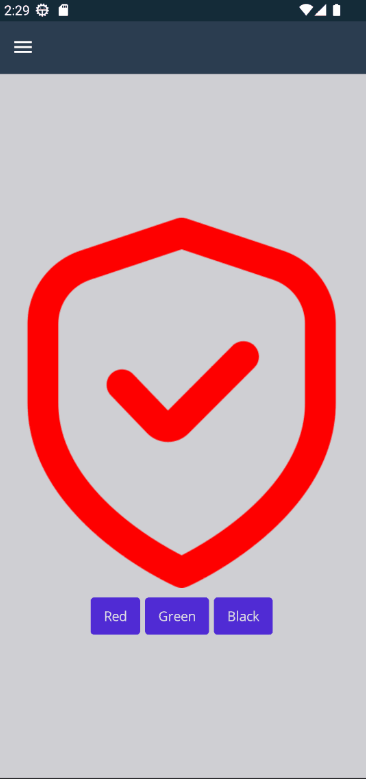

# Behaviors

> .NET Multi-platform App UI (.NET MAUI) behaviors let you add functionality to user interface controls without having to subclass them. Instead, the functionality is implemented in a behavior class and attached to the control as if it was part of the control itself.

Behaviors in MauiReactor are much less useful than in a classic XAML-MVVM project but sometimes you may need to integrate custom functionalities that are provided as behaviors.


Consider carefully whether or not you really need to use Behaviors in MauiReactor. Historically they were created to handle specific functionalities that MVVM approach would have required otherwise custom code-behind.

Behaviors like EventToCommandBehavior or EmailValidationBehavior are useless in MauiReactor while IconTintColorBehavior provides useful functionalities.

Generally, platform behaviors ([https://learn.microsoft.com/en-us/dotnet/maui/fundamentals/behaviors#platform-behaviors](https://learn.microsoft.com/en-us/dotnet/maui/fundamentals/behaviors#platform-behaviors)) provide unique functionalities very welcome even in a MauiReactor project.


For example, let's consider the `IconTintColorBehavior` (from MAUI CommunityToolkit): it allows to quickly set/change the color used to render a SVG image.

In MauiReactor, you need to scaffold the behavior and put it inside the `View` you want to attach as shown below:

```csharp
[Scaffold(typeof(CommunityToolkit.Maui.Behaviors.IconTintColorBehavior))]
partial class IconTintColorBehavior { }

class BehaviorTestPageState
{
    public Color Color { get; set; } = Colors.Red;
}

class BehaviorTestPage : Component<BehaviorTestPageState>
{
    public override VisualNode Render()
    {
        return new ContentPage()
        {
            new VStack(spacing: 10)
            {
                new Image("shield.png")
                {
                    new IconTintColorBehavior()
                        .TintColor(State.Color)
                },

                new HStack(spacing: 5)
                {
                    new Button(nameof(Colors.Red), () => SetState(s => s.Color = Colors.Red)),
                    new Button(nameof(Colors.Green), () => SetState(s => s.Color = Colors.Green)),
                    new Button(nameof(Colors.Black), () => SetState(s => s.Color = Colors.Black)),
                }
                .HCenter()
            }
            .Center()
        };
    }
}

```

<figure><figcaption><p>Behaviors in MauiReactor</p></figcaption></figure>
