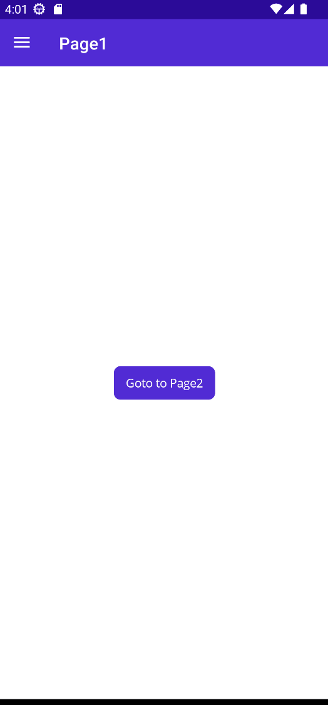
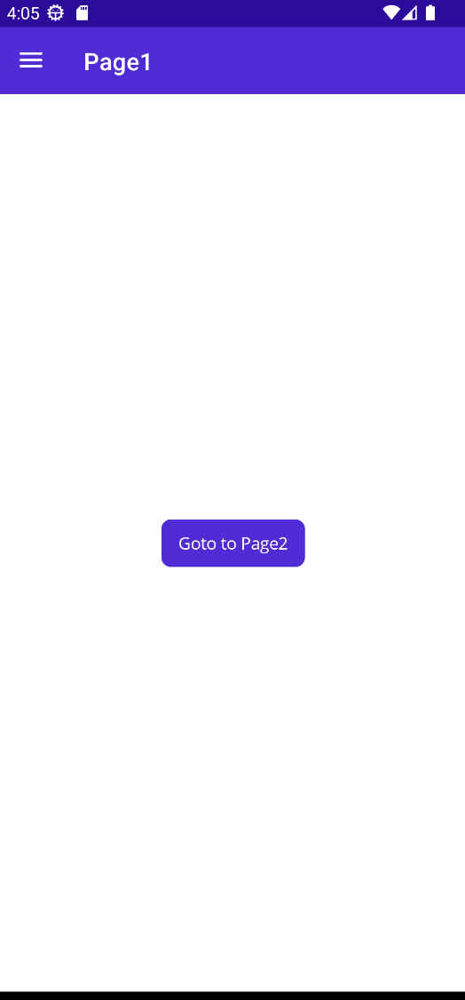

# Shell

Hosting pages inside a NavigationPage is a basic and flexible way to allow your users to navigate between pages of your application. For more info on how you can use it in MauiReactor please get a look at [this](navigation.md).

.NET MAUI provides also a more powerful way to navigate through the pages of your application better fitted for complex applications that have many pages with a well-structured hierarchy.

The Shell is a standard .NET MAUI control that provides many features including a routing-based navigation system. Often, developers set the Shell control as the root of their application.


[Official .NET MAUI documentation](https://learn.microsoft.com/en-us/dotnet/maui/fundamentals/shell/?view=net-maui-7.0) provides a good starting point to understand how to use the Shell control and it's mostly applicable to MauiReactor too.


In the following code we'll create a Shell with 2 FlyoutItem:

```csharp
class MainPage : Component
{
    public override VisualNode Render() 
        => new Shell
        {
            new FlyoutItem("Page1")
            {
                new ContentPage("Page1")
            },
            new FlyoutItem("Page2")
            {
                new ContentPage("Page2")
            }
        }
        .ItemTemplate(RenderItemTemplate);

    static VisualNode RenderItemTemplate(MauiControls.BaseShellItem item)
        => new Grid("68", "*")
        {
            new Label(item.Title)
                .VCenter()
                .Margin(10,0)
        };
}
```

This is the resulting behavior:

<figure><figcaption><p>Shell with FlyouItems</p></figcaption></figure>

The Shell can have many different kinds of children like FlyoutItem, ShellContent, Tab, ManuItem, etc. (for a full list of combinations please take a look at the official documentation).

## Loading pages on demand

In the above example, both pages are loaded at Shell startup. Often you want to load the pages on demand when the user interacts with the app, for example, by clicking on the menu item.

To load pages on demand you have to provide a callback function to the `ShellContent.RenderContent()` method.

```csharp
public override VisualNode Render() 
    => new Shell
    {
        new FlyoutItem("Page1")
        {
            new ShellContent()
                .RenderContent(() => new ContentPage("Page1"))
        },
        new FlyoutItem("Page2")
        {
            new ShellContent()
                .RenderContent(() => new ContentPage("Page2"))
        }
    }
    .ItemTemplate(RenderItemTemplate);
```

## Navigation and Routing

You can attach a route to a Shell item and navigate between pages calling the static method Shell.Current.GoToAsync() as shown below:

```csharp
public override VisualNode Render() 
    => new Shell
    {
        new FlyoutItem("Page1")
        {
            new ShellContent()
                .RenderContent(() => new ContentPage("Page1")
                {
                    new Button("Goto to Page2")
                        .HCenter()
                        .VCenter()
                    .OnClicked(async ()=> await MauiControls.Shell.Current.GoToAsync("//page-2"))
                })
        }
        .Route("page-1"),
        new FlyoutItem("Page2")
        {
            new ShellContent()
                .RenderContent(() => new ContentPage("Page2")
                {
                    new Button("Goto to Page1")
                        .HCenter()
                        .VCenter()
                    .OnClicked(async ()=> await MauiControls.Shell.Current.GoToAsync("//page-1"))
                })
        }
        .Route("page-2")
    }
    .ItemTemplate(RenderItemTemplate);

```

and this is the resulting effect:

<figure><figcaption><p>Navigating between pages using routes</p></figcaption></figure>

It's not required that you declare routes for all of your pages using items of the shell. You can register a route also using the Routing.RegisterRoute\<Component>() method as shown in the below example:

<pre class="language-csharp" data-line-numbers><code class="lang-csharp">class MainPage : Component
{
    protected override void OnMounted()
    {
<strong>        Routing.RegisterRoute&#x3C;Page2>("page-2");
</strong>        base.OnMounted();
    }

    public override VisualNode Render()
        => new Shell()
        {
            new FlyoutItem("Page1")
            {
                new ShellContent()
                    .RenderContent(() => new ContentPage("Page1")
                    {
                        new Button("Goto to Page2")
                            .HCenter()
                            .VCenter()
                        .OnClicked(async ()=> await MauiControls.Shell.Current.GoToAsync("page-2"))
                    })
            }
        }
        .ItemTemplate(RenderItemTemplate);            

    static VisualNode RenderItemTemplate(MauiControls.BaseShellItem item)
        => new Grid("68", "*")
        {
            new Label(item.Title)
                .VCenter()
                .Margin(10,0)
        };
}

class Page2 : Component
{
    public override VisualNode Render()
    {
        return new ContentPage("Page2")
        {
            new Button("Goto back")
                .HCenter()
                .VCenter()
            .OnClicked(async ()=> await MauiControls.Shell.Current.GoToAsync(".."))
        };
    }
}
</code></pre>

In MauiReactor you have to register a route for a Component that renders to a Page as shown in line 5 above.

<figure><figcaption><p>Shell custom routes</p></figcaption></figure>

## Passing parameters to pages

Often you have to pass arguments to the page when navigating to it (for example consider the case of a _ProductDetails_ page that requires the If of the product).

To pass parameters to a page you have to declare a component that accepts props like those shown below:

```csharp
class MainPage : Component
{
    protected override void OnMounted()
    {
        Routing.RegisterRoute<Page2>("page-2");
        base.OnMounted();
    }

    public override VisualNode Render()
        => new Shell()
        {
            new FlyoutItem("Page1")
            {
                new ShellContent()
                    .RenderContent(() => new ContentPage("Page1")
                    {
                        new Button("Goto to Page2")
                            .HCenter()
                            .VCenter()
                        .OnClicked(async ()=> 
                        await MauiControls.Shell.Current.GoToAsync<Page2Props>
                            ("page-2", props => props.Id = 23))
                    })
            }
        }
        .ItemTemplate(RenderItemTemplate);            

    static VisualNode RenderItemTemplate(MauiControls.BaseShellItem item)
        => new Grid("68", "*")
        {
            new Label(item.Title)
                .VCenter()
                .Margin(10,0)
        };
}

class Page2State
{ }

class Page2Props
{
    public int Id { get; set; }
}
class Page2 : Component<Page2State, Page2Props>
{
    public override VisualNode Render()
    {
        return new ContentPage("Page2")
        {
            new Button($"Received Id: {Props.Id}")
                .HCenter()
                .VCenter()
            .OnClicked(async ()=> await MauiControls.Shell.Current.GoToAsync(".."))
        };
    }
}
```

<figure><figcaption></figcaption></figure>
