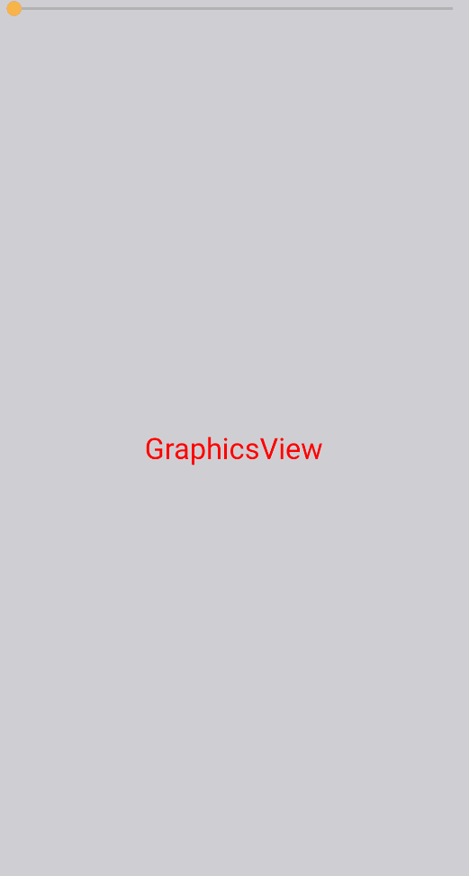

# Working with the GraphicsView

[GraphicsView](https://learn.microsoft.com/en-us/dotnet/maui/user-interface/controls/graphicsview) is a powerful control in .NET MAUI package that is capable of hiding all the complexity of using direct drawing commands among all the supported platforms: in other words, you can just place the control and issue drawing commands (like DrawReactangle, or DrawString).

Drawing graphics objects like Text, Rectangles, or Shapes in GraphicsView is generally more performant than creating native controls like Labels. In the brief article will see how to instantiate and use a GraphicsView in MauiReactor.


MauiReactor supports other means of drawing directly on a canvas. Please refer to this page to learn which are the other ways.


GraphicsView usage is pretty simple: you have just to create it and provide a function for its OnDraw callback where you can issue commands on the Canvas object in order to draw lines, text, shapes, and so on.

Let's start creating a page with a GraphicsView control inside a page and handle the OnDraw callback:

```csharp
class GraphicsViewPage : Component
{
    public override VisualNode Render()
    {
        return new ContentPage("GraphicsView Sample")
        {
            new GraphicsView()
                .OnDraw(OnDraw)
        };
    }

    private void OnDraw(ICanvas canvas, RectF dirtyRect)
    {
        canvas.FontColor = Colors.Red;
        canvas.FontSize = 24;
        canvas.DrawString("GraphicsView", dirtyRect, HorizontalAlignment.Center, VerticalAlignment.Center);
    }
}
```

This should result in something similar to the below screen:

<figure><figcaption><p>Just a GraphicsView with a text centered</p></figcaption></figure>


Please note that under iOS and macOS the GraphicsView has a default black background while under Android has transparent default. You should consider setting the background of the canvas to a specific value.


To make the test a bit more interesting let's convert the component into a stateful one and rotate the text with a slider as shown in the following code:

```csharp
class GraphicsViewState
{
    public double Rotation { get; set; }
}

class GraphicsViewPage : Component<GraphicsViewState>
{
    public override VisualNode Render()
    {
        return new ContentPage("GraphicsView Sample")
        {
            new Grid("Auto, *", "*")
            {
                new Slider()
                    .Minimum(0)
                    .Maximum(360)
                    .Value(State.Rotation)
                    .OnValueChanged((s,e)=>SetState(s => s.Rotation = e.NewValue))
                    ,
                new GraphicsView()
                    .GridRow(1)
                    .OnDraw(OnDraw)
            }
        };
    }

    private void OnDraw(ICanvas canvas, RectF dirtyRect)
    {
        canvas.Rotate((float)State.Rotation, dirtyRect.Center.X, dirtyRect.Center.Y);
        canvas.FontColor = Colors.Red;
        canvas.FontSize = 24;
        canvas.DrawString("GraphicsView", dirtyRect, HorizontalAlignment.Center, VerticalAlignment.Center);
    }
}
```

As you can see we can access State properties inside the `OnDraw` method as well.


Hot-reloading can handle any modifications to the GraphicsView control including the OnDraw callback.


This should be the resulting behavior:

<figure><figcaption></figcaption></figure>
